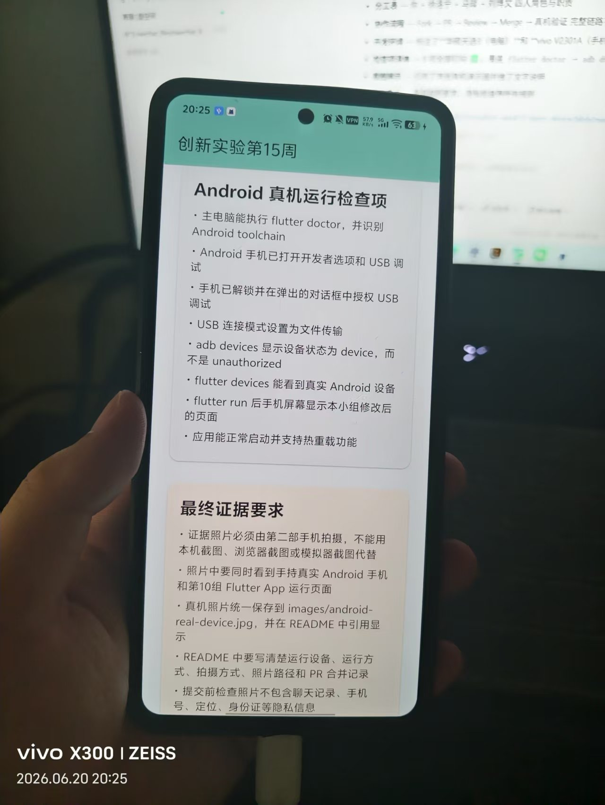

# 第 10 组 · 创新实验第 15 周成果

> 📱 **第10组 Flutter Android 真机验收看板** — 用 GitHub 协作，把第14周个人 Hello World 升级成小组真机运行成果

🔗 **仓库地址**: https://github.com/Ros258/innovation-week15-team-device

---

## 👥 小组成员与分工

| 角色 | 姓名 | 负责内容 |
|------|------|----------|
| 🔵 组长 | 苏再旭 | 创建原始仓库、维护 `main`、审核 PR、组织真机运行与证据提交 |
| 🟢 成员 A | 徐洛宁 | 修改 `groupName`、`projectTitle`、`projectSlogan` |
| 🟢 成员 B | 马琰 | 补全 `members` 中的成员姓名与分工 |
| 🟢 成员 C | 刘博文 | 补充 `realDeviceChecks` 中的真机运行检查项 |

---

## ✅ 协作流程

1. 组长 Fork 个人 Hello World 项目并创建 GitHub 仓库
2. 各成员通过 GitHub Fork + Pull Request 提交代码修改
3. 组长在本地 Review 后 Merge 到 `main`
4. `flutter run` 部署到真机验证
5. 截取真机照片作为验收证据

---

## 🚀 快速启动

```bash
cd week15
flutter pub get
flutter devices
flutter run -d <你的设备ID>
```

---

## 💻 开发环境

| 项目 | 版本 / 型号 |
|------|-------------|
| 操作系统 | Windows 11 |
| Flutter SDK | 3.29.3 |
| Dart SDK | 3.7.4 |
| Android SDK | 36.1.0 |
| Gradle | 8.4 |
| **开发电脑（真机）** | **华硕天选3 (ASUS TUF Gaming)** |
| **测试手机（真机）** | **vivo V2301A (Android, USB + ADB)** |

---

## ✅ 真机运行检查项

- [x] 主电脑能执行 `flutter doctor`，并识别 Android toolchain
- [x] Android 手机已打开开发者选项和 USB 调试
- [x] 手机已解锁并在弹出的对话框中授权 USB 调试
- [x] USB 连接模式设置为文件传输
- [x] `adb devices` 显示设备状态为 `device`，而非 `unauthorized`
- [x] `flutter devices` 能看到真实 Android 设备
- [x] `flutter run` 后手机屏幕显示本小组修改后的页面
- [x] 应用能正常启动并支持热重载功能

---

## 📸 真机演示截图

### 截图 1 — 小组看板首页

手机（vivo V2301A）上运行的 Flutter 应用首页，展示小组信息与成员分工。


### 截图 2 — 检查项详情页

展示 Android 真机运行的完整检查清单与验收要求说明。



> 📷 以上照片均由 **vivo V2301A (V2301A)** 真机拍摄，开发主机为 **华硕天选3**，通过 USB + ADB 连接调试。照片中清晰可见真实 Android 手机屏幕和 Flutter App 运行界面。

---

## 📝 验收要点

- ✅ 证据照片必须用**第三部手机拍摄**（非本机截屏/模拟器）
- ✅ 照片中需同时看到手持 **Android 手机** 和 Flutter **App 运行界面**
- ✅ 真机截图已保存至 `images/android-real-device*.jpg`，并在 README 中引用展示
- ✅ README 中填写清楚运行设备、运行方式、拍照设备留有 PR 合并记录
- ✅ 提交前检查照片不包含聊天记录、手机号、定位、身份证等隐私信息
