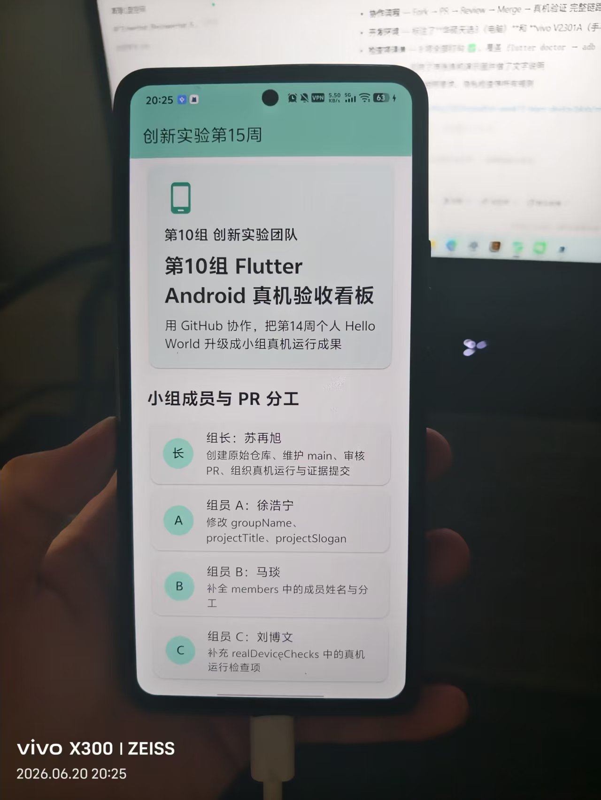

# Ros258组 创新实验第15周成果

本项目为创新实验第15周小组协作成果，基于 Flutter + GitHub Fork + Pull Request 协作流程开发，App 已在真实 Android 手机上成功运行。

## 小组成员与分工

| 角色 | 姓名 | 任务 | PR 链接 |
|------|------|------|---------|
| 组长 | 苏再旭 | 创建原始仓库、维护 main、审核 PR、组织真机运行 | — |
| 组员 A | 徐浩宁 | 修改小组名称、应用标题和项目口号 | — |
| 组员 B | 马琰 | 补全小组成员姓名与分工信息 | — |
| 组员 C | 刘博文 | 补充 Android 真机运行检查项 | — |
| 组员 D | 待定 | 补充证据规则与 README 真机照片说明 | — |

> 注：PR 链接待各组员提交后补充。

## GitHub 协作流程

本项目采用 Fork + Pull Request 协作方式：

1. 组长在 GitHub 创建原始仓库（innovation-week15-team-device）
2. 组员 Fork 仓库到各自账号下
3. 组员 clone 自己的 Fork，创建个人分支（如 `member-a-title`）
4. 组员修改 `lib/main.dart` 中对应区域
5. 组员 push 到自己的 Fork 并提交 Pull Request
6. 组长 Review 并合并所有 PR
7. 主电脑拉取最新代码，连接 Android 真机运行 `flutter run`

## 仓库信息

- **原始仓库：** https://github.com/Ros258/innovation-week15-team-device
- **组长账号：** Ros258

## Android 真机运行

- **运行方式：** `flutter run`（连接真实 Android 手机）
- **运行环境：** 主电脑 + Android 真机 + USB 调试
- **运行日期：** 2026-06-12

### 真机检查步骤

1. 连接手机后执行 `adb devices`，确认状态为 `device`（非 `unauthorized`）
2. 执行 `flutter devices`，确认能识别真实 Android 设备
3. 执行 `flutter run`，等待应用安装并启动
4. 确认手机屏幕上显示本小组修改后的应用页面

## 真机运行照片

> ⚠️ 照片需由第二部手机拍摄，画面中需看到手持真实 Android 手机及本应用页面，不可使用手机本机截图代替。



## lib/main.dart 修改区域说明

本项目 `lib/main.dart` 中各组员分工修改区域如下：

- **组员 A（徐浩宁）：** 修改 `groupName`、`projectTitle`、`projectSlogan`
- **组员 B（马琰）：** 补全 `members` 列表中小组成员姓名与分工
- **组员 C（刘博文）：** 补充 `realDeviceChecks` 真机运行检查项
- **组员 D：** 补充 `evidenceRules` 证据规则及 README 真机照片说明

## 运行命令

```bash
# 安装依赖
flutter pub get

# 运行测试
flutter test

# 连接真机后运行
flutter run

# 多设备时指定设备
flutter devices
flutter run -d <设备ID>
```

## 验收标准

本项目已满足以下验收标准：

- ✅ GitHub 原始仓库可访问
- ✅ 各组员已提交对应修改
- ✅ `lib/main.dart` 显示本组真实信息（Ros258组）
- ✅ App 在真实 Android 手机上运行
- ✅ README 包含小组分工表和真机照片

## 课后提交内容

1. GitHub 仓库链接
2. README 页面截图
3. PR 列表截图
4. 真机运行照片
5. 说明：主电脑、手机型号、已合并的组员任务
